# Finnie: AI Finance Assistant

Finnie is a multi-agent assistant that teaches beginners about investing. Six specialist agents, orchestrated with LangGraph, answer questions about financial concepts, portfolios, markets, goals, news, and taxes. Answers are grounded in a 113-article knowledge base with sources, and combined with live market data.

**Finnie provides educational information only, not financial, investment, tax, or legal advice.**

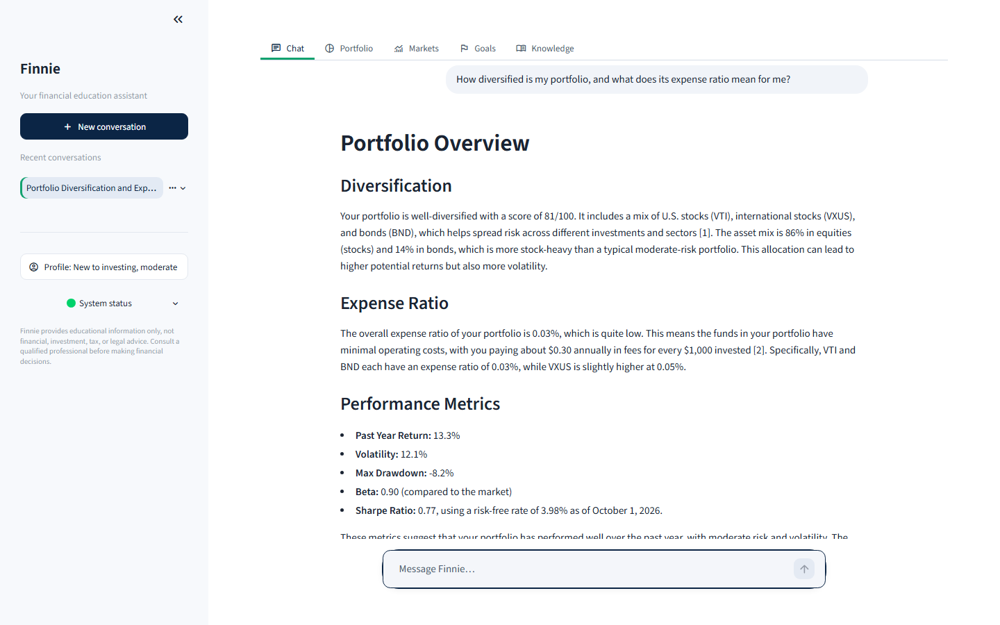

## Demo video

▶ **[Watch the demo on YouTube](https://youtu.be/R6OB4C5JQJA)** (about 9 minutes, unlisted). It walks through the architecture, onboarding, multi-agent chat with voice input and read-aloud, portfolio entry and analysis, markets, goal planning, the knowledge base, the MCP server, and Claude Desktop.

The same video is in the submission ZIP at `demo/Finnie_Demo_Adam_Mazhar.mp4` (1920×1080), with subtitles in `demo/Finnie_Demo_Adam_Mazhar.srt`; the MP4 also carries them as a subtitle track you can turn on.

## Contents

- [Demo video](#demo-video)
- [Quick start with Docker](#quick-start-with-docker)
- [Quick start with Python](#quick-start-with-python)
- [Configuration](#configuration)
- [Using Finnie](#using-finnie)
- [Example questions](#example-questions)
- [API documentation](#api-documentation)
- [Tests and evaluations](#tests-and-evaluations)
- [MCP server (Claude Desktop and Claude Code)](#mcp-server-claude-desktop-and-claude-code)
- [Beyond the problem statement](#beyond-the-problem-statement)
- [Architecture](#architecture)
- [Project structure](#project-structure)
- [Troubleshooting](#troubleshooting)
- [Further documentation](#further-documentation)

## Quick start with Docker

You need [Docker](https://docs.docker.com/get-docker/) with Compose 2.24 or later, and an OpenAI or Anthropic API key.

```bash
git clone https://github.com/adammazhar/finnie-ai-finance-assistant.git
cd finnie-ai-finance-assistant
cp .env.example .env          # Windows: copy .env.example .env
# edit .env: set OPENAI_API_KEY (or ANTHROPIC_API_KEY and LLM_PROVIDER=anthropic)
docker compose up
```

Open http://localhost:8501.

**Where the image comes from:**
- **Published image (the default):** `docker compose up` pulls the ready-made image `ghcr.io/adammazhar/finnie-ai-finance-assistant`. CI publishes it on every push to `main`, after the image and the tests pass, tagged `latest` and with the commit SHA. Run `docker compose pull` to update to the newest one.
- **Build it yourself:** `docker compose up --build` builds the image from your checkout instead, which takes a few minutes. Use this after changing the code.
- **Visibility:** the image has the same visibility as this GitHub repository. While the repository is private, pulling needs `docker login ghcr.io` with a GitHub token that has `read:packages`, or use `--build`. The image becomes public when the repository is made public.

**What's in the image:** CPU-only PyTorch, the embedding model, and the prebuilt search index, so the container never downloads a model. It holds no secrets; your keys come from `.env` when it starts.

**Saved data:** your profile, portfolio, and conversations live in a Docker volume, so they're kept across restarts.

**Stop:** press Ctrl+C, or run `docker compose down`. `docker compose down -v` also deletes the saved data.

## Quick start with Python

You need **Python 3.12**, about 2 GB of free disk (CPU-only PyTorch plus the embedding model), and an OpenAI or Anthropic API key.

### 1. Install

macOS / Linux:

```bash
git clone https://github.com/adammazhar/finnie-ai-finance-assistant.git
cd finnie-ai-finance-assistant
python3.12 -m venv .venv
source .venv/bin/activate
pip install -r requirements-dev.txt   # runtime + test tools; CPU-only PyTorch comes from the index in requirements.txt
pip install -e . --no-deps            # makes the `src` package importable
```

Windows (PowerShell):

```powershell
git clone https://github.com/adammazhar/finnie-ai-finance-assistant.git
cd finnie-ai-finance-assistant
py -3.12 -m venv .venv                # or: python -m venv .venv, if `python --version` says 3.12
.venv\Scripts\Activate.ps1            # if blocked: Set-ExecutionPolicy -Scope CurrentUser RemoteSigned
pip install -r requirements-dev.txt
pip install -e . --no-deps
```

For runtime only, `pip install -r requirements.txt` is enough.

### 2. Add your API key

```bash
cp .env.example .env    # Windows: copy .env.example .env
```

Set `OPENAI_API_KEY` in `.env` (see [Configuration](#configuration) for the other settings). `.env` is git-ignored; never commit it.

### 3. Download the embedding model and build the search index (one time)

`.env.example` sets `HF_HUB_OFFLINE=1`, so Finnie only loads the embedding model (`all-MiniLM-L6-v2`, about 90 MB) from the local Hugging Face cache and never contacts the Hub. The first time, allow the download once:

```bash
HF_HUB_OFFLINE=0 python scripts/build_index.py                                           # macOS/Linux
```

```powershell
$env:HF_HUB_OFFLINE = "0"; python scripts/build_index.py; Remove-Item Env:HF_HUB_OFFLINE   # Windows
```

This builds the FAISS index in `data/vectorstore/` (about a minute). After that, everything except the LLM and market data APIs runs offline. The index rebuilds itself when knowledge base articles change.

### 4. Run the app

```bash
python -m src.web_app
```

Open http://localhost:8501. The launcher starts Streamlit from the project root, where `.streamlit/config.toml` (the theme) lives. `streamlit run src/web_app/app.py` also works if you run it from the project root.

## Configuration

Secrets and the provider choice go in **`.env`**. Every other setting is in **`config.yaml`**.

| `.env` variable | Needed? | What it does |
|---|---|---|
| `OPENAI_API_KEY` | Yes, for the default provider | Models `gpt-4o` (answers) and `gpt-4o-mini` (routing, checks, titles), and `whisper-1` for voice input |
| `ANTHROPIC_API_KEY` | Optional | Automatic fallback when OpenAI fails, or the primary provider with `LLM_PROVIDER=anthropic` |
| `LLM_PROVIDER` | Optional (`openai`) | `openai` or `anthropic` |
| `LLM_FALLBACK_PROVIDER` | Optional (`anthropic`) | The provider to fall back to; `none` disables the fallback |
| `ALPHA_VANTAGE_API_KEY` | Optional | Second market data source and company facts. Without it, Finnie uses yfinance. |
| `TAVILY_API_KEY` | Optional | Extra news search. Without it, news comes from yfinance. |
| `HF_HUB_OFFLINE` | Keep `1` | Loads the embedding model from the local cache only |
| `MCP_API_TOKEN` | Only for the MCP HTTP server | Bearer token, at least 32 characters ([docs/MCP.md](docs/MCP.md)) |
| `FINNIE_CONFIG` | Optional | Another settings file instead of `config.yaml` |
| `SEC_CONTACT_EMAIL` | Only to refresh the SEC ticker list | The SEC asks automated tools to identify themselves; `scripts/update_sec_tickers.py` puts this in its User-Agent |

Without a usable API key, the app opens a setup page that names the missing key, instead of an error.

`config.yaml` covers:
- models per provider, temperature, timeouts, and retries
- retrieval (chunk size, `top_k`, the 0.40 relevance threshold)
- market data cache times (60 seconds while the market is open)
- the workflow's turn budget and limits
- Monte Carlo settings
- the MCP server's address

Each setting has a comment.

## Using Finnie

On a first visit, Finnie asks for your knowledge level and risk tolerance. A 5-question quiz helps if you're unsure. Answers adapt to your level: plain language and defined terms for beginners, more depth for advanced users.

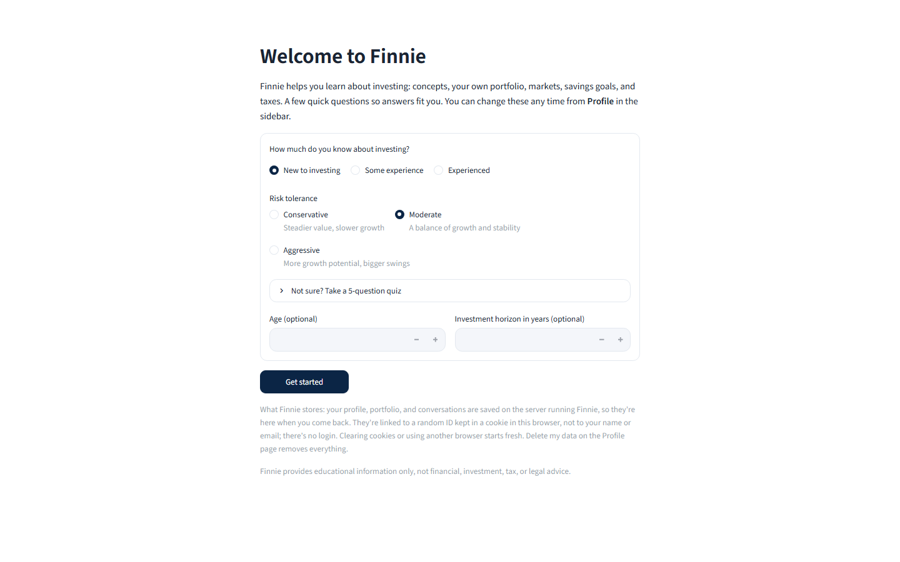

**Chat** is the main page. Ask anything in the box pinned at the bottom.
- **While it works:** the chat shows which specialists are running.
- **The answer:** it streams in with the specialists who wrote it, numbered citations, and the sources behind them, plus charts when they help.
- **Multi-part questions:** a question that spans topics (for example, "how diversified is my portfolio, and what does its expense ratio mean?") goes to several specialists, and their answers are merged into one.
- **Goal questions:** if you have a saved portfolio, Finnie first asks how much of it counts toward the goal.
- **Voice:** press the microphone in the chat box and ask out loud. The transcript appears in the box so you can check or edit it, then press Enter to send. It needs `OPENAI_API_KEY`; the recording is sent to OpenAI for transcription and isn't stored by Finnie.
- **Read aloud:** each answer has a 🔊 **Read aloud** button. Your browser's built-in voice reads the answer, leaving out the disclaimer and sources. It needs no key.

| | |
|---|---|
| 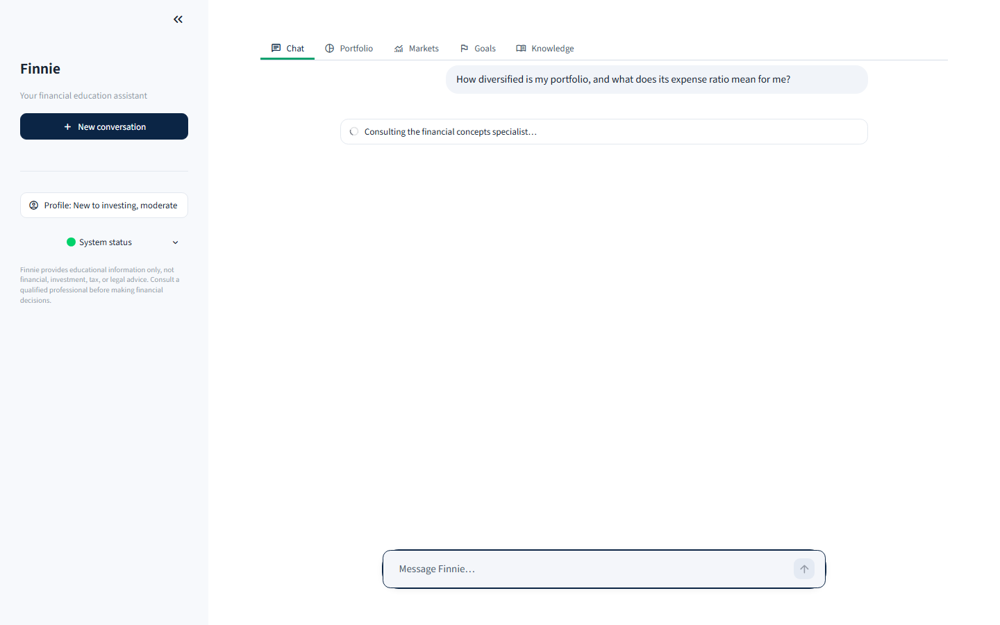 |  |

| Tab | What it does |
|---|---|
| **Portfolio** | Enter holdings, upload a CSV (`ticker,shares,cost_basis`), or load a sample. Shows allocation, diversification, risk, fund fees, past-year risk measures, a back-test against SPY, and a comparison with a typical mix for your risk tolerance. Saved holdings are used in chat too. |
| **Markets** | The S&P 500, Nasdaq-100, Dow, and Russell 2000 with their tracking ETFs, sector moves, and whether prices are live, delayed, or the last close. Also a lookup by **name or ticker**: type "Apple" or "S&P 500" and pick from the suggestions (from the SEC's company list and Finnie's fund and index list; anything else is searched on Yahoo Finance). It shows the price trend, moving averages, RSI, company facts, and recent news. |
| **Goals** | A Monte Carlo projection for a goal: the chance of reaching it, the range of outcomes, and the monthly amount an 80% chance needs. Each goal type starts from sensible inputs (an emergency fund from a small, short, cash-like goal; retirement from your profile's horizon or age), and your inputs are saved for next time. |
| **Knowledge** | Search the knowledge base, browse the 113 articles by category, and look up 173 glossary terms. Every article lists its sources (SEC, FINRA, IRS, Federal Reserve, and others). |

| | |
|---|---|
| 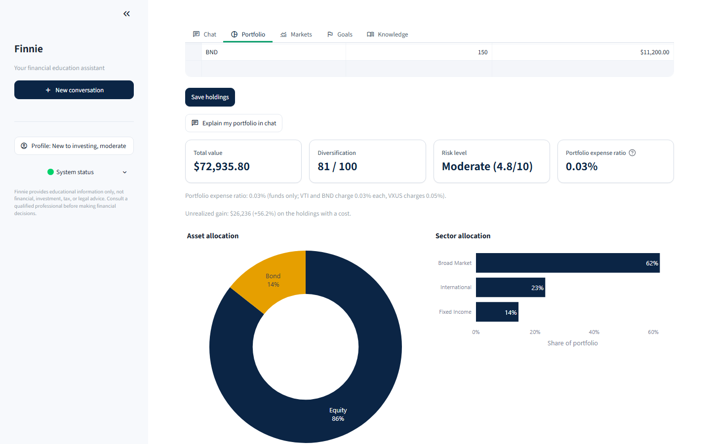 | 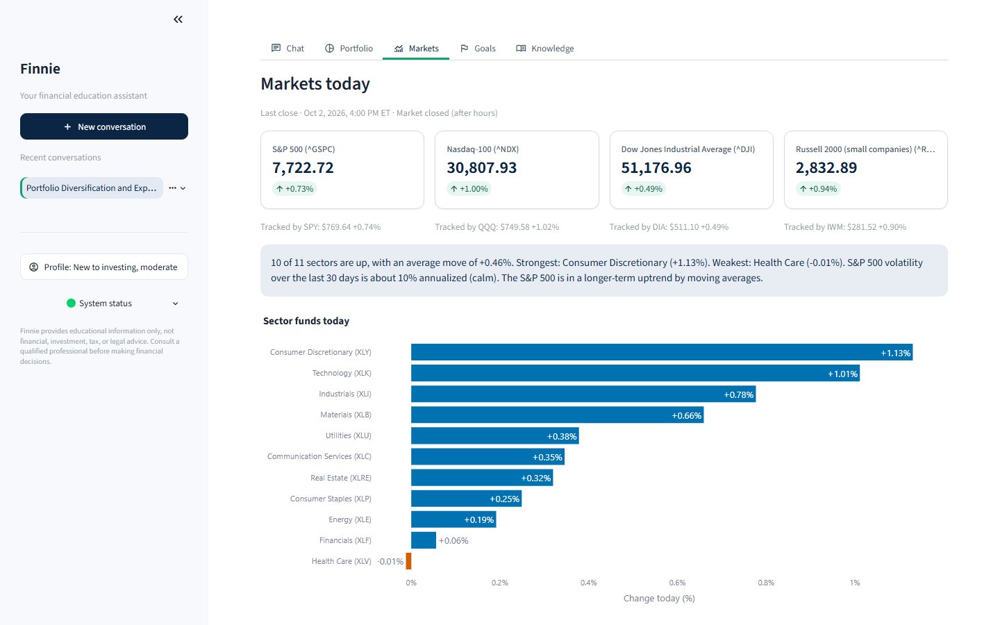 |
| 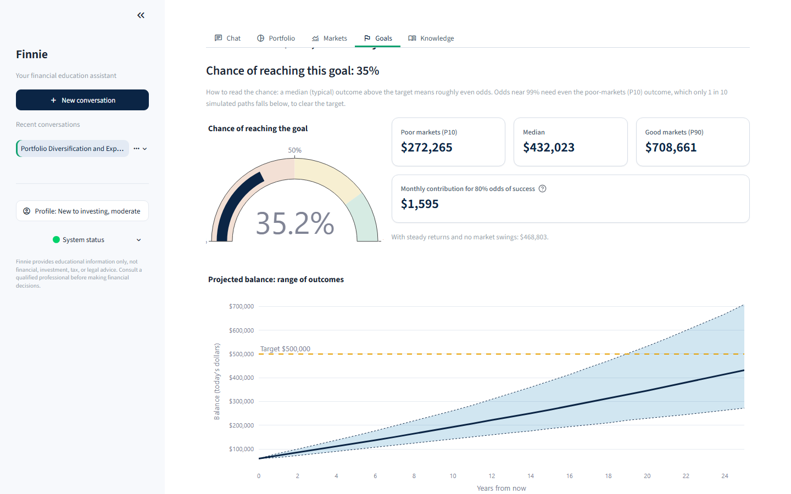 | 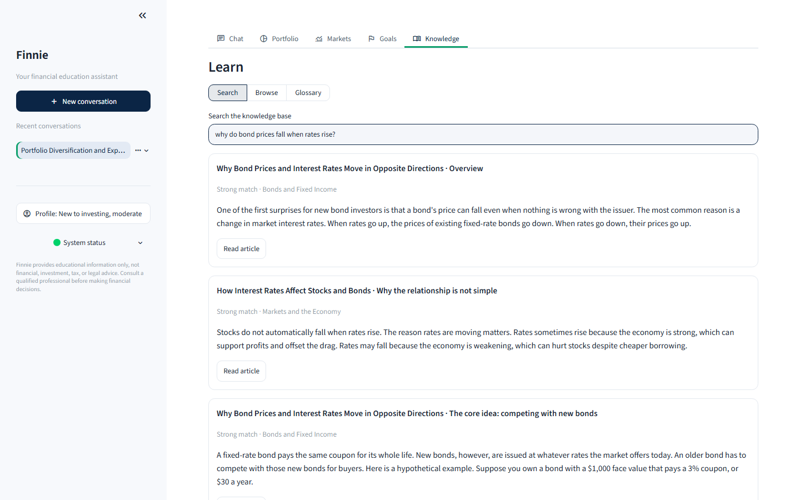 |

**Saved data, without a login:**
- **Where:** Finnie remembers your profile, portfolio, and conversations under a random ID kept in a browser cookie. The data is stored in `data/app/finnie.sqlite`, which is git-ignored, so it's still there after a refresh or an app restart.
- **Managing it:** rename or delete a conversation from its **⋯** menu in the sidebar. **Profile → Delete my data** removes everything for your browser.
- **Fresh start:** a private browser window always starts fresh.

## Example questions

Each one goes to a different specialist; follow-ups in the same conversation keep the context.

| Ask | Who answers | What you get |
|---|---|---|
| *What is an index fund?* then *How is that different from an ETF?* | Finance Q&A | A plain-language explanation with cited sources; the follow-up understands "that" |
| *How diversified is my portfolio, and what does its expense ratio mean for me?* (after saving holdings) | Portfolio + Finance Q&A, merged | Your diversification score, allocation, and fees, explained |
| *How is the stock market doing today?* | Market Analysis | Index and sector moves, with when the prices are from |
| *What's the latest news on Apple?* | News Synthesizer | 3–5 recent stories, summarized, with links and dates |
| *I want $50,000 for a house down payment in 8 years. I can add $400 a month.* | Goal Planning | The chance of reaching it and the monthly amount for an 80% chance. With a saved portfolio, Finnie first asks how much of it counts. |
| *What's the difference between a Roth IRA and a traditional IRA?* | Tax Education | Side-by-side rules with this year's IRS limits |
| *Should I buy Tesla stock right now?* | Guardrail | Education about evaluating a stock, not a recommendation |

[docs/DEMO.md](docs/DEMO.md) is a scripted 8-minute walk-through of all of these.

## API documentation

Everything the app does is also available to code. Full reference with tested examples: **[docs/API.md](docs/API.md)**.

```python
from src.core.models import Holding, UserProfile
from src.workflow.graph import FinnieAssistant

assistant = FinnieAssistant()  # reads .env and config.yaml
out = assistant.ask(
    "What is an index fund?",
    thread_id="demo",
    profile=UserProfile(knowledge_level="beginner", risk_tolerance="moderate"),
)
print(out.answer)  # markdown with numbered citations and the disclaimer
# ['finance_qa'] ['https://www.investor.gov/...', ...]
print(out.agents, [s.url for s in out.sources])
```

- **`FinnieAssistant`** (`src/workflow/graph.py`):
  - `ask` returns the whole answer.
  - `stream` yields progress events, then the answer.
  - `state`, `forget`, and conversation titles are there too.
- **Domain layer** (no LLM needed): market data with fallbacks, portfolio analytics, Monte Carlo goal projections, tax reference, and knowledge base search.
- **MCP**: six tools with typed schemas, two resources, and a prompt ([docs/MCP.md](docs/MCP.md)).
- **External APIs and their fallbacks**: OpenAI, Anthropic, yfinance, Alpha Vantage, Tavily, and Hugging Face.

## Tests and evaluations

```bash
pytest                                   # 1,028 tests in parallel, 100% coverage; network blocked, so no API calls
ruff check . && ruff format --check .    # lint and formatting
mypy                                     # type checks
python scripts/validate_kb.py            # knowledge base rules (schema, ids, sources)
```

These need API keys or the internet, and report the numbers in [docs/BENCHMARKS.md](docs/BENCHMARKS.md):

```bash
python scripts/check_kb_links.py         # every knowledge base source link resolves
python scripts/eval_retrieval.py         # retrieval quality: hit@4 93.3%
python scripts/eval_routing.py           # routing accuracy: 97.0% (LLM), 78.8% (keyword fallback)
python scripts/bench_workflow.py         # end-to-end latency with live models and data
python scripts/bench_mcp.py              # MCP tool latency over HTTP
python scripts/bench_voice.py DIR        # transcription speed and accuracy (DIR: name.wav + name.txt pairs)
```

GitHub Actions runs these jobs on every push:
- lint, type checks, docstring coverage (every public function, 100%), and tests
- the Streamlit UI tests
- the combined coverage gate (90%)
- the knowledge base link check
- a Docker job: it builds the image, starts it with `docker compose`, checks that search and the app work with networking switched off, and checks the MCP server's token protection
- on `main` only, a publish job: after the Docker job and the coverage gate pass, it pushes the image to GitHub Container Registry and checks that `docker compose up` pulls and runs it

## MCP server (Claude Desktop and Claude Code)

Finnie's tools are also an [MCP](https://modelcontextprotocol.io) server:
- **6 tools:** quotes, market overview, portfolio analysis, goal projection, knowledge base search, and tax accounts
- **resources:** the articles and the glossary
- **a beginner prompt**

The client (Claude) does the reasoning; Finnie supplies the data. Full setup is in [docs/MCP.md](docs/MCP.md).

- **Claude Desktop (stdio):**
  1. Add the `finnie` entry from docs/MCP.md to `claude_desktop_config.json` (**Settings → Developer → Edit Config**).
  2. Fully quit Claude Desktop from the system tray.
  3. Start it again.
- **HTTP on localhost (Claude Code, scripts):** set `MCP_API_TOKEN` in `.env`, then:

  ```bash
  python -m src.mcp_server --http          # http://127.0.0.1:8765/mcp; requests without the token get 401
  python scripts/mcp_client_demo.py        # shows the 401s, then lists tools and calls one with the token
  claude mcp add --transport http --scope local finnie http://127.0.0.1:8765/mcp --header "Authorization: Bearer <token>"
  ```

  With Docker: `docker compose --profile mcp up` runs the HTTP server next to the app.

## Beyond the problem statement

The rubric's bonus line rewards advanced features, creative problem solving, and a technical roadmap. Here is what Finnie adds for each, and where to check it:

| Bonus line asks for | What Finnie does | Evidence |
|---|---|---|
| **Advanced features** (the rubric's examples: "voice interface, sophisticated portfolio analytics, or novel AI techniques") | **Voice interface**: speak a question into the chat box (OpenAI `whisper-1`) and review the transcript before sending; every answer can be read aloud by the browser. | `src/core/voice.py`, `src/web_app/tabs/chat.py`; `tests/unit/core/test_voice.py` and the voice tests in `test_app_chat.py`; checked in a real browser with a simulated microphone; [BENCHMARKS: voice](docs/BENCHMARKS.md#voice-transcription) (1.2–1.6 s median, 0–2% word error rate) |
| | **Sophisticated portfolio analytics**: HHI diversification, fee drag, Sharpe, beta, max drawdown, correlation, a back-test against SPY, a look-through stock/bond mix for target-date and balanced funds, and **Monte Carlo goal planning** (10,000 fat-tailed paths, inflation, an 80%-odds contribution solver). | `src/core/portfolio.py`, `src/core/monte_carlo.py`; property-based tests (Hypothesis) |
| | **Novel AI techniques**: six LangGraph specialists in staged parallel plans with bounded hand-offs; an LLM router with a keyword fallback (97.0% / 78.8%); retrieval tuned on an evaluation set (hit@4 91–93%, 100% off-topic rejection); an MCP server over stdio and token-protected HTTP; LLM provider fallback. | DESIGN §2–4 and §9; `scripts/eval_routing.py`, `scripts/eval_retrieval.py`; `tests/unit/mcp_server/` |
| **Creative problem solving** ("exceptional creativity in solving user problems") | **Testing with AI personas**: three AI agents (a beginner, a near-retiree, a skeptical investor) used the app only through a browser. Their findings drove real fixes: role-play guardrails, IRS-sourced 401(k) vs IRA exceptions and RMD ages, "mix unknown" funds, and Goals defaults. | [SUBMISSION.md: simulated user testing](docs/SUBMISSION.md#simulated-user-testing-ai-personas) |
| | **Deterministic safety nets around the model**: input screening (including fiction and hypothetical framing), an output check for directives, guarantees, and comparative picks, and a fixed "Finnie can't pick" opening when the model leaves it out. | `src/core/guardrails.py`; adversarial tests in `tests/unit/core/test_guardrails.py` |
| | **Honest data**: market-hours-aware caching with freshness labels; stale then labelled mock data when providers fail; tax facts and fund mixes from IRS and Vanguard documents with dates. | `src/core/market_hours.py`, `src/data/service.py`, `data/reference/` |
| | **Small things beginners need**: search by name ("Apple", "S&P 500"); a risk quiz; saved data without a login; plain-language help on every metric; questions asked back when something is unclear. | Markets, Profile, and Portfolio tabs; `src/data/symbols.py` |
| **Technical roadmap** ("clear vision for future enhancements") | Three horizons with the technical approach for each: login, cloud deployment, remote MCP with OAuth 2.1, and Postgres; then better answers (a citation-support check, hybrid retrieval, fund look-through); then the problem statement's future directions (multi-modal input, international markets, mobile). | [DESIGN §17](docs/DESIGN.md#17-roadmap) |

The same mapping, with more detail, is in [docs/SUBMISSION.md](docs/SUBMISSION.md#beyond-the-problem-statement).

## Architecture

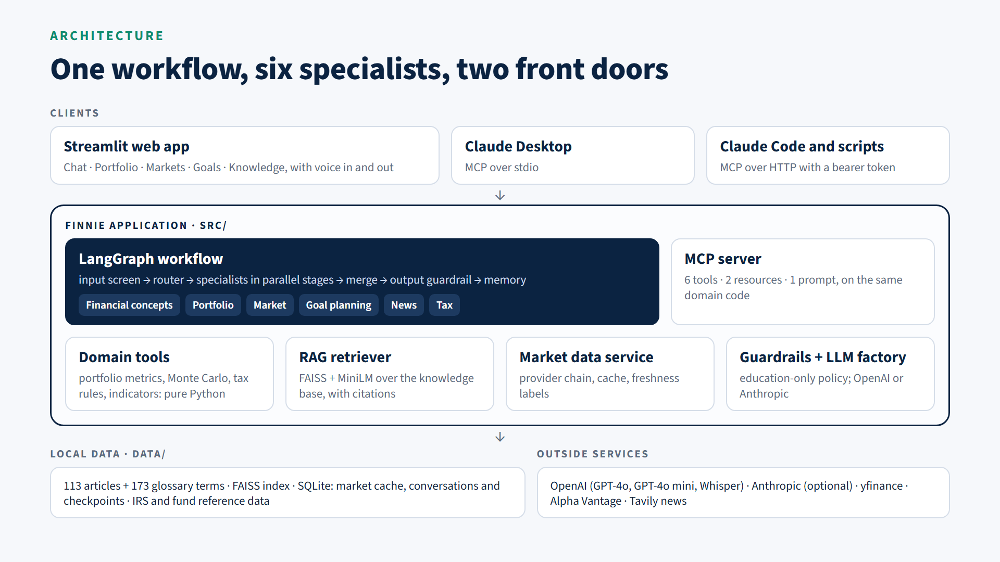

**How a question flows through the workflow (`src/workflow/`):**
1. **Screening:** an input check rejects prohibited or oversized requests.
2. **Routing:** a fast model picks the specialists. A keyword router is the fallback.
3. **Planning:** the plan runs the specialists in stages, in parallel within a stage (LangGraph `Send`). Agents that need another agent's results run in a later stage; for example, goal planning can use the portfolio analysis.
4. **Merging:** the answers are merged into one, with unified citations.
5. **Output guard:** a check rewrites anything that reads like personal advice, then adds data-freshness notes and the disclaimer.

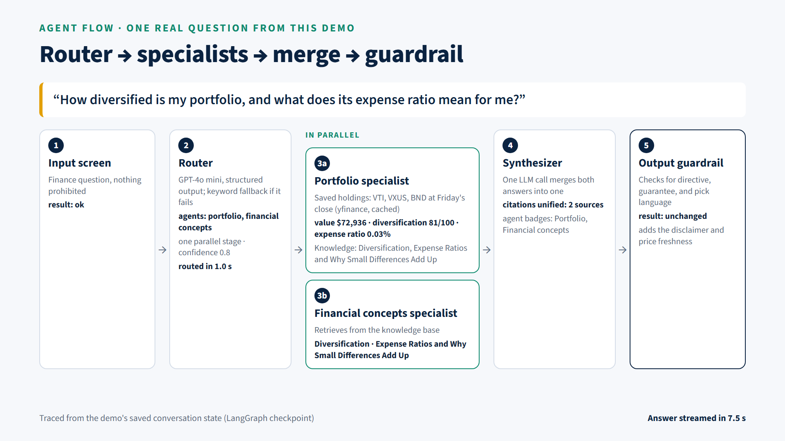

**Memory:** conversation memory is kept per conversation in a SQLite checkpointer, and older turns are summarized.

**The specialists (`src/agents/`):**

| Agent | Teaches about |
|---|---|
| Finance Q&A | Concepts and definitions (the default) |
| Portfolio Analysis | Diversification, allocation, risk, and fees of your holdings |
| Market Analysis | Quotes, indexes, sectors, and indicators, in plain English |
| Goal Planning | Saving toward a goal, with Monte Carlo odds |
| News Synthesizer | Recent news, summarized with why it matters |
| Tax Education | Account types, capital gains, and this year's IRS limits |

**Design choices:**
- **Domain logic:** it's pure, LLM-free code in `src/core` and `src/data`, shared by the agents and the MCP server and fully unit-tested.
- **Failure handling:** each layer has a fallback.
  - LLM provider fallback and retries
  - a keyword router when routing fails
  - market data provider chain → stale cache → clearly labelled mock data
  - a turn deadline
  - a plain-language reply when every agent fails

**Tech stack:**

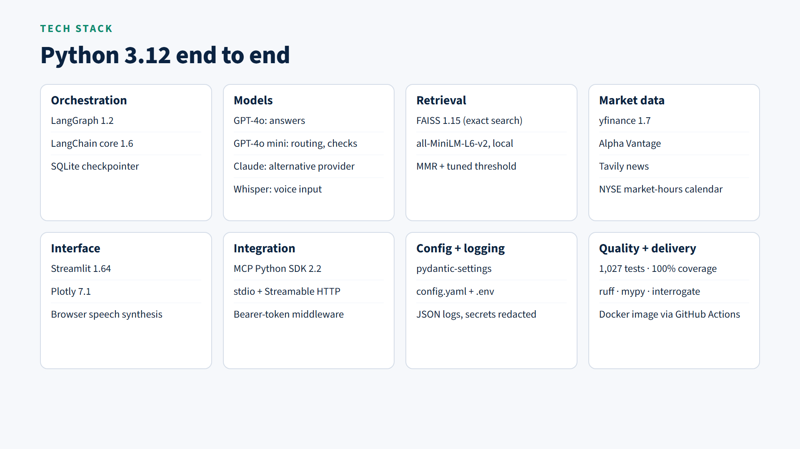

**Grounding:** cited knowledge and a market data provider chain.

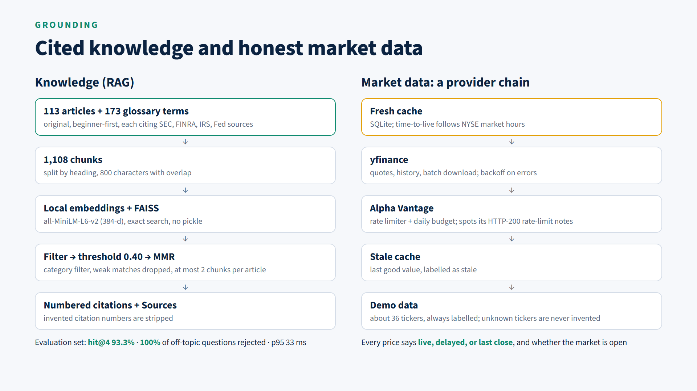

**MCP server:** the same tools for Claude Desktop (stdio) and other clients (HTTP with a token).

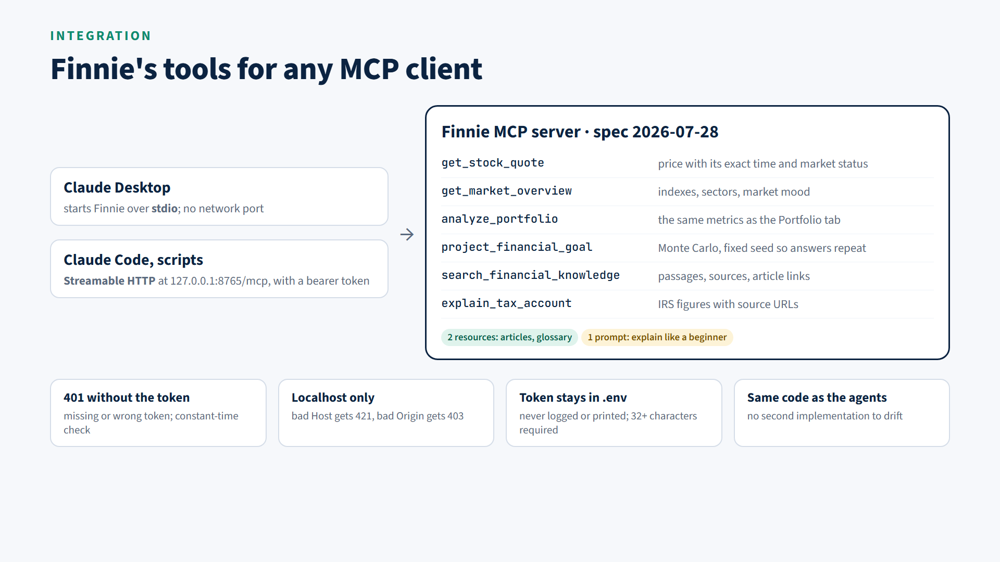

Details, Mermaid versions of these diagrams, and the reasons behind each choice are in [docs/DESIGN.md](docs/DESIGN.md).

## Project structure

```text
src/
  core/         config, LLM factory, guardrails, portfolio math, Monte Carlo, tax, indicators
  data/         market data providers, cache, news
  rag/          knowledge base loader, chunking, FAISS index, retriever
  agents/       the six specialists, their tools and prompts
  workflow/     LangGraph graph: router, planner, nodes, synthesis, titles
  web_app/      Streamlit app, pages, charts, theme, per-browser storage
  mcp_server/   MCP tools, HTTP transport and token check, launcher
data/
  knowledge_base/   113 articles (markdown with sources) + glossary
  reference/        securities catalog, tax figures, market calendar
  sample_portfolios/
scripts/        index build, SEC ticker refresh, evaluations, benchmarks, MCP demo client
tests/          unit tests, UI tests, evaluation sets
docs/           DESIGN.md, MCP.md, BENCHMARKS.md, images/
```

## Troubleshooting

| Problem | Fix |
|---|---|
| "Finnie needs an API key to start" | Set `OPENAI_API_KEY` in `.env` (or `ANTHROPIC_API_KEY` with `LLM_PROVIDER=anthropic`) and restart. |
| "The embedding model … isn't in the local Hugging Face cache" | Run step 3 once with `HF_HUB_OFFLINE=0`. |
| The app looks dark or unstyled | Start it with `python -m src.web_app`, or run Streamlit from the project root. |
| `py -3.12` not found, or the venv uses another Python | Install Python 3.12 from python.org, then create the venv with that interpreter. |
| `Activate.ps1 cannot be loaded` | `Set-ExecutionPolicy -Scope CurrentUser RemoteSigned`, then activate again. |
| Market data says "mock" or "stale" | A provider is down or rate-limited. Finnie labels the data and keeps working. The sidebar's **System status** shows each provider. |
| Port 8501 is busy | `python -m src.web_app --server.port 8502` (Docker: change the first number in `docker-compose.yml` → `ports`). |
| `docker compose up` says `denied` or `unauthorized` when pulling | The repository (and so the image) is private: run `docker login ghcr.io` with a GitHub token that has `read:packages`, or build locally with `docker compose up --build`. |
| `docker compose` complains about `env_file` | Update to Docker Compose 2.24 or later, or create `.env` from `.env.example`. |
| MCP: Claude Desktop doesn't list finnie | See the checklist in [docs/MCP.md](docs/MCP.md#1-claude-desktop-stdio-windows). |

## Further documentation

- [docs/DESIGN.md](docs/DESIGN.md): architecture, workflow, agents, RAG, data, UI, MCP, security, testing, deployment, and the decisions log
- [docs/BENCHMARKS.md](docs/BENCHMARKS.md): retrieval quality, routing accuracy, latency, MCP and Docker measurements
- [docs/MCP.md](docs/MCP.md): MCP server setup and verification
- [docs/API.md](docs/API.md): Python and MCP API reference with tested examples
- [docs/DEMO.md](docs/DEMO.md): the demo video script
- [docs/SUBMISSION.md](docs/SUBMISSION.md): every rubric line and deliverable, with where to find the evidence
- [DESIGN.md §17](docs/DESIGN.md#17-roadmap): the technical roadmap
- Optional cloud deployment (AWS EC2 with Caddy, or ECS Fargate) is designed in [DESIGN.md §12](docs/DESIGN.md#12-docker-and-aws-deployment). It is not deployed.

---

*Finnie provides educational information only, not financial, investment, tax, or legal advice. Consult a qualified professional before making financial decisions.*
